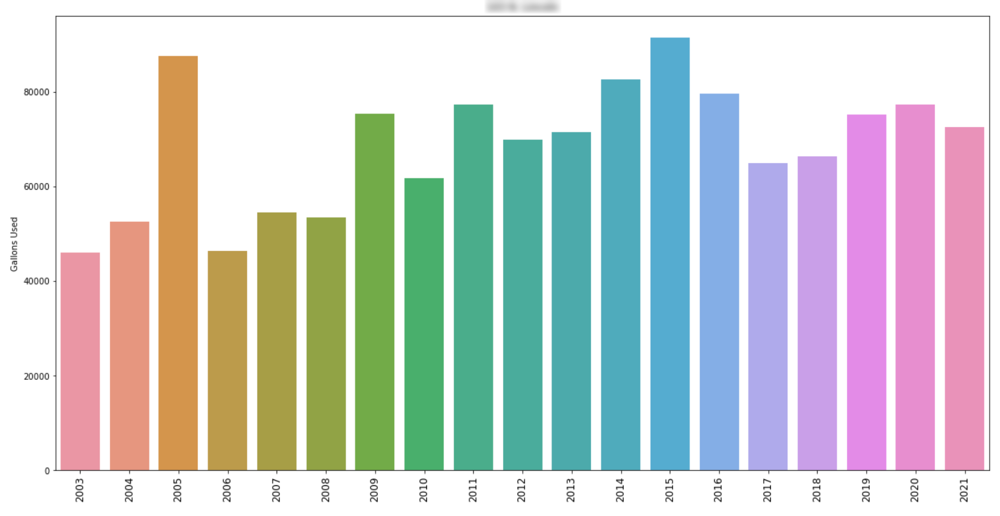
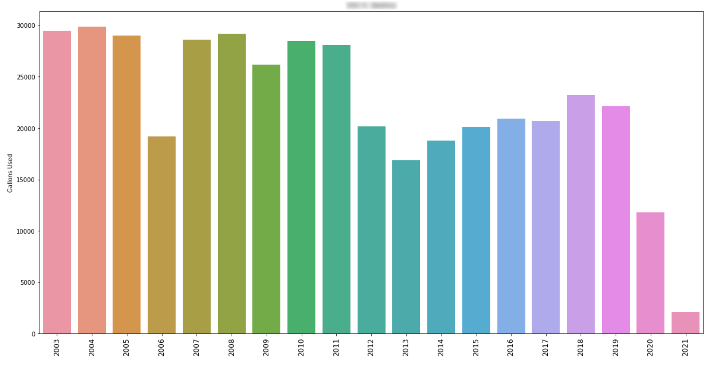
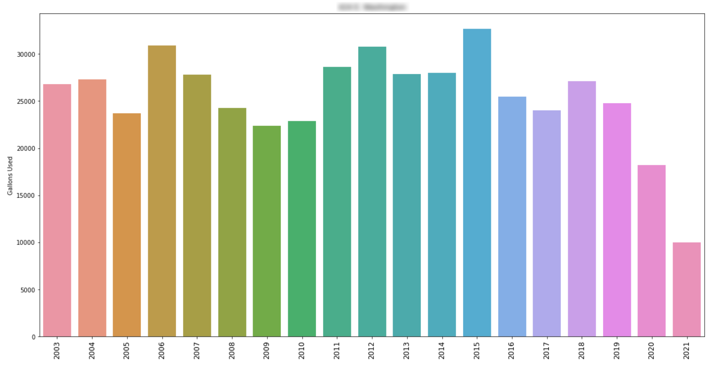
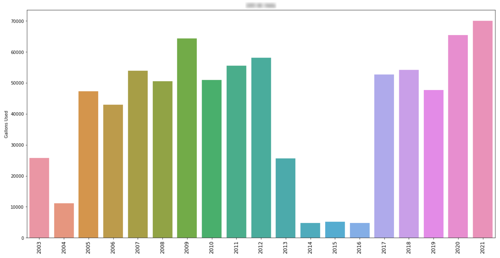

<h3><center>The Leaky Faucet: A SQL-Based Real World Project</center></h3>

A local municipality discovered that it was being charged for higher water consumption than what was indicated by the residents' meters. After no underground leaks were detected, the water board suspected the discrepancy stemmed from problematic water usage data collection and/or reporting. I volunteered to examine the town's water usage and billing data to see if the mystery of the missing water could be solved.

The town's billing system used Microsoft Access, so I used an open-source tool to convert the data to a SQLite database for performing standard analysis. I began with basic EDA.

(Please note that some data have been altered to protect PII and results truncated for demo purposes.)

```
SELECT name 
FROM sqlite_master 
WHERE type='table';
```

| name                 |
| :--- |
| Company              | 
| Rates                |
| System History       |
| System Meters        |
| new_customer_history |
| Customer             |

```
PRAGMA table_info(new_customer_history);
```

| cid | name              | type     | notnull | 
|:----|:------------------|:---------|:--------|
| 0   | Route             | DOUBLE   | 0       | 
| 1   | Service Adr       | TEXT     | 0       |
| 2   | Beginning Reading | DOUBLE   | 0       |
| 3   | Beginning Date    | DATETIME | 0       |
| 4   | Current Reading   | DOUBLE   | 0       |
| 5   | Current Date      | DATETIME | 0       |
| 6   | Useage            | DOUBLE   | 0       |
| 7   | Amount            | DOUBLE   | 0       |
| 8   | BaseRate          | DOUBLE   | 0       |

```
SELECT * 
FROM new_customer_history;
```

| Route | Service Adr | Beginning Reading | Beginning Date      | Current Reading | Current Date        | Useage     | Amount    | BaseRate | Other1 | Other1 Amount | Other 2 | Other 2 Amount | Other 3 | Other 3 Amount | Taxable Amount | Local Tax | County Tax | State Tax | Total Tax | Previous Balance | Late | Total Amount | Trans Date          | Trans Type | Period Total | Memo | CustID | rateSched | proRate | estReading | Posted | DueDate | LogDate | mtrMult |
|:------|:------------|:------------------|:--------------------|:----------------|:--------------------|:-----------|:----------|:---------|:-------|:--------------|:--------|:---------------|:--------|:---------------|:---------------|:----------|:-----------|:----------|:----------|:-----------------|:-----|:-------------|:--------------------|:-----------|:-------------|:-----|:-------|:----------|:--------|:-----------|:-------|:--------|:--------|:--------|
 193.0 | RR Mayfield   | 62270000.0        | 2003-02-24 00:00:00 | 76614000.0      | 2003-03-25 00:00:00 | 14344000.0 | 81775.25  |          |        | 0.0           |         | 0.0            |         | 0.0            | 81775.25       | 4088.76   | 0.0        | 0.0       | 4088.76   | 187019.1         | 0.0  | 272883.11    | 2003-03-26 00:00:00 | I          | 85864.01     |      | 6      | 3         | 0       | 0          | 1      |         |         | 1.0     |
| 193.0 | RR Mayfield   | 76614000.0        | 2003-03-25 00:00:00 | 148755000.0     | 2003-07-28 00:00:00 | 72141000.0 | 411218.15 |          |        | 0.0           |         | 0.0            |         | 0.0            | 411218.15      | 20560.91  | 0.0        | 0.0       | 20560.91  | 272883.11        | 0.0  | 704662.17    | 2003-07-28 00:00:00 | I          | 431779.06    |      | 6      | 3         | 0       | 0          | 1      |         |         | 1.0     |
| 193.0 | RR Mayfield   | 148755000.0       | 2003-07-28 00:00:00 | 178186975.0     | 2003-08-25 00:00:00 | 29431975.0 | 167776.71 |          |        | 0.0           |         | 0.0            |         | 0.0            | 167776.71      | 8388.84   | 0.0        | 0.0       | 8388.84   | 704662.17        | 0.0  | 880827.72    | 2003-08-25 00:00:00 | I          | 176165.55    |      | 6      | 3         | 0       | 0          | 1      |         |         | 1.0     |
| 50007.0 | 801 Barnes | 0.0               | 2016-12-27 00:00:00 | 0.0             | 2017-01-25 00:00:00 | 0.0    | 0.0    | 0.0      | Garbage | 15.0          |         | 0.0            |         | 0.0            | 0.0            | 0.0       | 0.0        | 0.0       | 0.0       | 0.0              | 0.0  | 15.0         | 2017-01-25 00:00:00 | I          | 15.0         | UtilBill | 287    | 10        | 0       | 0          | 1      | 2017-02-15 00:00:00 |         | 1.0     |
| 50008.0 | 505 Valley Avenue  | 0.0               | 2016-12-27 00:00:00 | 0.0             | 2017-01-25 00:00:00 | 0.0    | 0.0    | 0.0      | Garbage | 15.0          |         | 0.0            |         | 0.0            | 0.0            | 0.0       | 0.0        | 0.0       | 0.0       | -12.0            | 0.0  | 3.0          | 2017-01-25 00:00:00 | I          | 15.0         | UtilBill | 288    | 10        | 0       | 0          | 1      | 2017-02-15 00:00:00 |         | 1.0     |


Almost 125,000 rows were returned. Next, I queried how many unique residences & businesses were represented by this data.


```
SELECT DISTINCT "Service Adr"
FROM new_customer_history
WHERE Useage >=0
ORDER BY "Service Adr";
```

| Service Adr      |
|:-----------------|
|  1167 Main Street |
|  1167 Main St.    |
|  1168 Main Street | 
| 1170 E. Cook   |
| 1170 E Cook   |

There were 441 records returned. However, some of the addresses are duplicated based on irregular data entry practices ("St." vs "Street", "E." vs "E", etc.). I'll alter the table to normalize the data.

```
UPDATE
    new_customer_history
SET
    "Service Adr" = REPLACE(REPLACE(REPLACE("Service Adr",'.',''),"Street", "St"), "Avenue", "Ave");
```

| SQL                                                                                                                                      | Message                | Duration (s) |
|:-----------------------------------------------------------------------------------------------------------------------------------------|:-----------------------|:-------------|
| UPDATE     new_customer_history SET     "Service Adr" = REPLACE(REPLACE(REPLACE("Service Adr",'.',''),"Street", "St"), "Avenue", "Ave"); | Affected rows: 124,958 | 0.317254     |

It worked! After running the query again to get the number of distinct properties, it's down to 404 unique addresses.

In order to align with the client's legacy billing system, I modified the date format for 2 columns.

```
SELECT Route, "Service Adr", 
    substr("Beginning Date", 6, 2) 
	|| '/' 
	|| substr("Beginning Date", 9,2)
	|| '/' 
	|| substr("Beginning Date", 1,4) AS "Beginning Date Reformatted", 
    "Current Reading", 
    substr("Current Date", 6, 2) 
	|| '/' 
	|| substr("Current Date", 9,2)
	|| '/' 
	|| substr("Current Date", 1,4) AS "Current Date Reformatted",
    Useage, Amount
FROM new_customer_history;
```

| Route | Service Adr | Beginning Date Reformatted | Current Reading | Current Date Reformatted | Useage     | Amount    |
|:------|:------------|:---------------------------|:----------------|:-------------------------|:-----------|:----------|
| 193.0 | RR Mayfield  | 12/23/2002                 | 47651000.0      | 01/24/2003               | 16623900.0 | 94770.68  |
| 193.0 | RR Mayfield  | 01/24/2003                 | 62270000.0      | 02/24/2003               | 14619000.0 | 83342.75  |
| 193.0 | RR Mayfield  | 02/24/2003                 | 76614000.0      | 03/25/2003               | 14344000.0 | 81775.25  |
| 193.0 | RR Mayfield  | 03/25/2003                 | 148755000.0     | 07/28/2003               | 72141000.0 | 411218.15 |

Next, I aggregated meter readings by year.

```
SELECT "Service Adr", 
    strftime("%Y", "Current Date") AS Year, 
    Useage, 
    SUM(Useage) AS "Yearly Useage"
FROM new_customer_history
WHERE Useage >=0
GROUP BY "Service Adr", Year
```

| Service Adr      | Year | Useage | Yearly Useage |
|:-----------------|:-----|:-------|:--------------|
| 109 E Sherman | 2017 | 2500.0 | 22200.0       |
| 109 E Sherman | 2018 | 200.0  | 4400.0        |
| 109 E Sherman | 2019 | 700.0  | 28500.0       |
| 109 E Sherman | 2020 | 0.0    | 42000.0       |
| 109 E Sherman | 2021 | 4000.0 | 42000.0       |

To visualize water usage over time for each property, I imported the results of this SQLite query into a Pandas DataFrame and wrote a function to graph the data using Matplotlib and Seaborn.

[](assets/png/graph1blur.png)
[](assets/png/graph2blur.png)
[](assets/png/graph3blur.png)
[](assets/png/graph5blur.png)

These graphs made it easy to recognize aberant water usage patterns over the last year. Presently the city clerk is examining these graphs to see which trends can't be explained by houses being vacated, a change in the number of residents, etc. To help with that, I appended a miscellaneous notes column from another table onto the main table.

```
ALTER TABLE new_customer_history ADD COLUMN Misc_Notes VARCHAR;
```

```
UPDATE new_customer_history
SET Misc_Notes = "Msc 2"
FROM Customer	
WHERE Customer.Route = new_customer_history.Route;
```

```
SELECT Route, "Service Adr", "Useage", Misc_Notes
FROM new_customer_history                   
```

| Route | Service Adr     | Useage | Misc_Notes             |
|:------|:----------------|:-------|:-----------------------|
| 234.0 | 203 S Jefferson | 800.0  | to RSB Enterprises Inc |
| 72.0 | 204 S Jefferson |     1559200.0   | Old System Meter-Do not bill-see notes |
| 234.0 | 203 S Jefferson | 400.0  |  |
| 234.0 | 203 S Jefferson |   (NULL)     |4 unit Apartment-owner pays-no Garbage |

Hopefully this will provide enough of a breadcrumb trail to deduce where the discrepancy  in water usage data stems from. If not, my next step will be to examine the invoice data against water meter readings. 💧💧💧